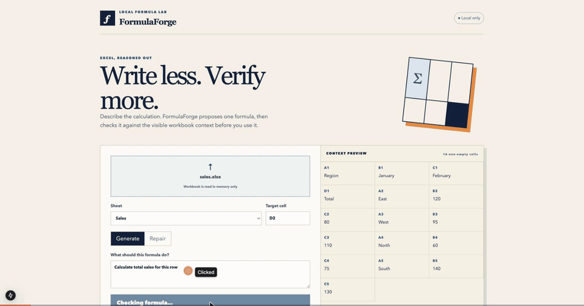
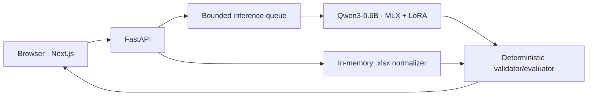

# FormulaForge

A local-first Excel formula copilot — a fine-tuned 0.6B model proposes formulas, a
deterministic evaluator verifies every one before you see it.

[](https://github.com/yousefsaid/formulaforge/actions/workflows/ci.yml)
&nbsp;·&nbsp;[Live demo](#) _(link goes here once Phase 3 hosted demo ships)_


_(demo GIF goes here once Phase 3 recording ships)_

## Why this exists

**Privacy.** Spreadsheets never leave the machine. Inference, validation, and preview all
run locally — nothing about the workbook's contents is sent anywhere.

**Trust, not vibes.** Language models hallucinate. FormulaForge treats every model output
as untrusted input: a deterministic validator/evaluator checks syntax, supported
functions, cell references, and execution before a formula is ever shown, and abstention
is a first-class outcome when the model can't produce something verifiable.

**Constraint as engineering.** A 0.6B model running on Apple Silicon unified memory is a
hard budget, not an accident. The single-slot inference queue, the fixed LoRA recipe, and
the narrow workbook boundary are all direct consequences of taking that constraint
seriously instead of hiding it.

## Architecture



## Results

_Base-vs-fine-tuned evaluation numbers land here after Phase 2 produces real report
artifacts in `artifacts/reports/`. No metric is published until it's measured — see
[docs/EVAL_REPORT.md](docs/EVAL_REPORT.md)._

## Quick start

```bash
make setup
make api
make web
```

The API listens on `127.0.0.1:8000`; the web app listens on `localhost:3000`. Model
conversion, training, and evaluation are deliberately separate from server startup:

```bash
make baseline  # records untouched Qwen3-0.6B metrics
make train     # MLX-LM LoRA (rank 8, final 8 layers)
make evaluate  # produces artifacts/reports and docs/EVAL_REPORT.md
```

## Safety boundary

Uploads stay in memory and are never saved. Only `.xlsx` files up to 2 MB are accepted.
Macro files, encrypted workbooks, external links, excess archive expansion, excess
sheets/cells, unsupported formulas, ambiguous sheets, circular references, and evaluation
failures are rejected or abstained from. v1 supports arithmetic, comparisons,
references/ranges, and `SUM`, `AVERAGE`, `MIN`, `MAX`, `COUNT`, `COUNTA`, `IF`, `SUMIF`,
`COUNTIF`, `INDEX`, `MATCH`, and `VLOOKUP`.

## Docs

- [Architecture](docs/ARCHITECTURE.md)
- [Model card](docs/MODEL_CARD.md)
- [Data card](docs/DATA_CARD.md)
- [Evaluation report](docs/EVAL_REPORT.md)
- [Demo walkthrough](docs/DEMO.md)
